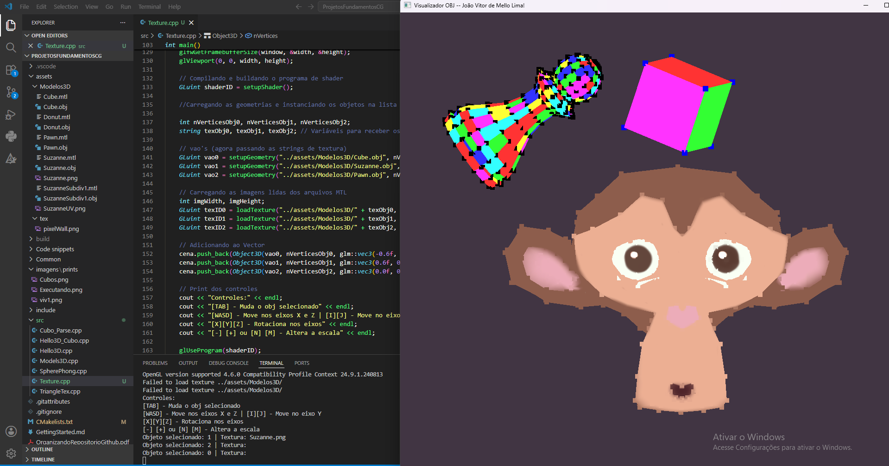
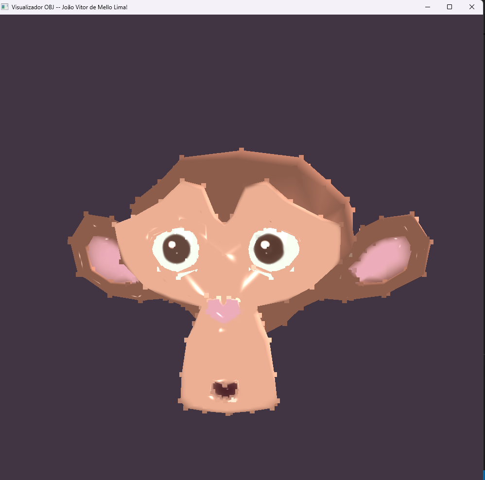
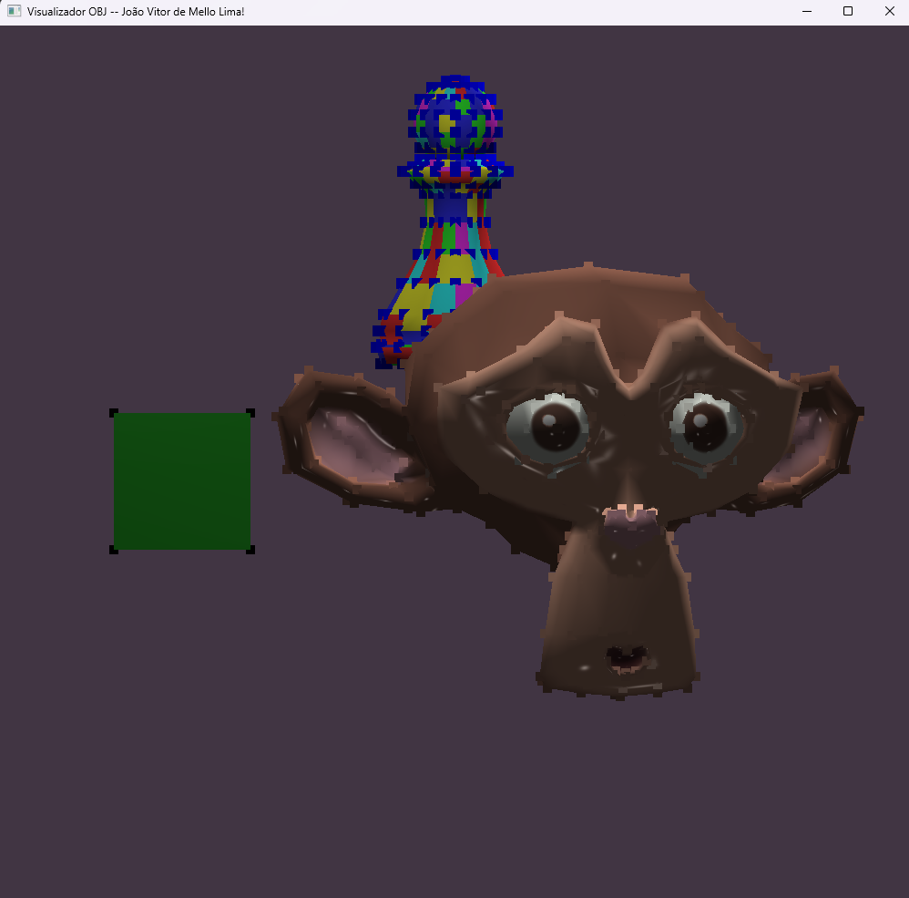
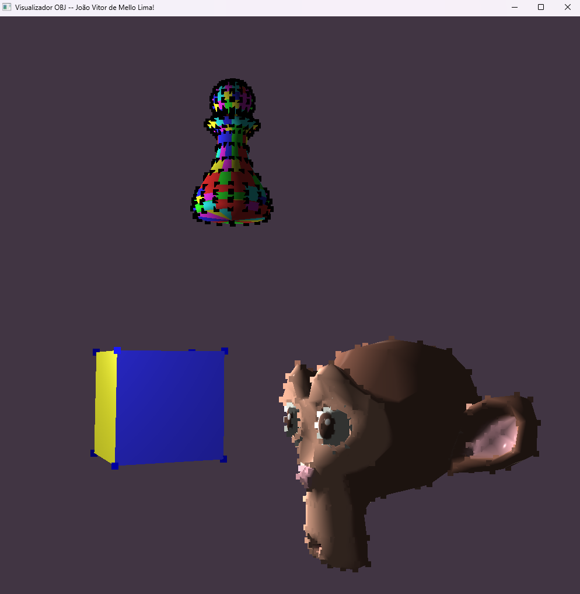

Atividade 1: Print executando o código com o nome da janela trocada.

Atividade 2: Print com 3 cubos instanceados, as demais implementações estão em "Hello3D_Cubo.cpp".

Atividade Vivencial 1: Requisitos do enunciado implementados em "Modelos3D.cpp".

Atividade 3: Print da execução com a textura disponibilizada, as implementações estão em "Texture.cpp".

Atividade 4: Print da execução com o Obj Suzanne devidamente iluminado, as impplemenações estão em "Lux.cpp".

Atividade Vivencial 2: Print executando, implementação de 3 fontes de luz, possibilidade de habilitar e desabilitar (indivudualmente cada luz) e fator de atenuação na parcela de reflexão difusa, assim como outras melhorias em "Lux3.cpp".

Atividade 5: Print executando, a implementação da câmera, e movimentação em "Cam.cpp".

Atividade 6: A implementação de animação/trajetória ciclica está em "Animation.cpp".
