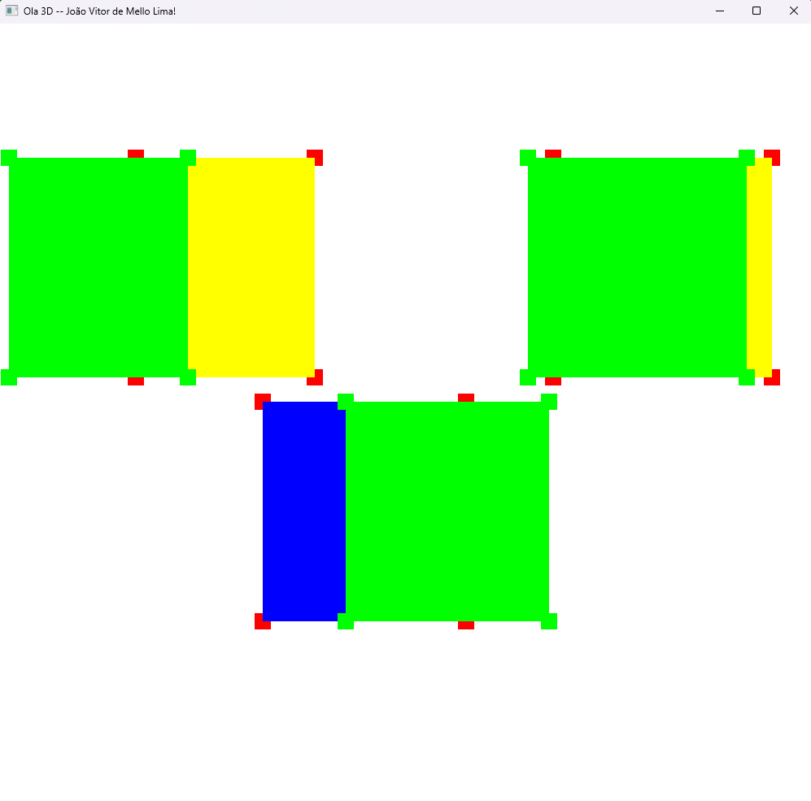
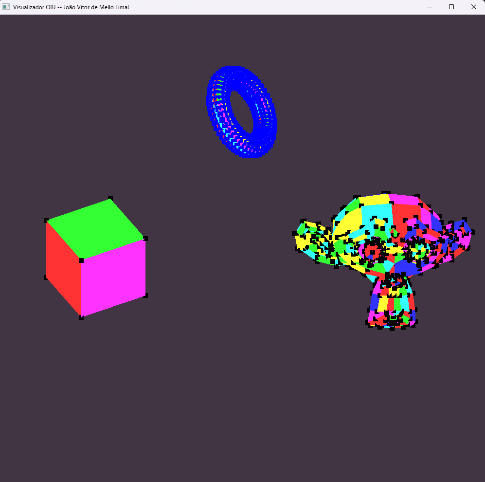

Atividade 1: Print executando o código com o nome da janela trocada.

Atividade 2: Print com 3 cubos instanceados, as demais implementações estão em "Hello3D_Cubo.cpp"

Atividade Vivencial 1: Requisitos do enunciado implementados em "Modelos3D.cpp"

